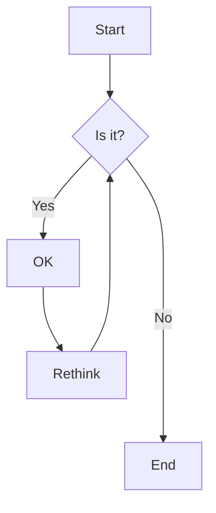
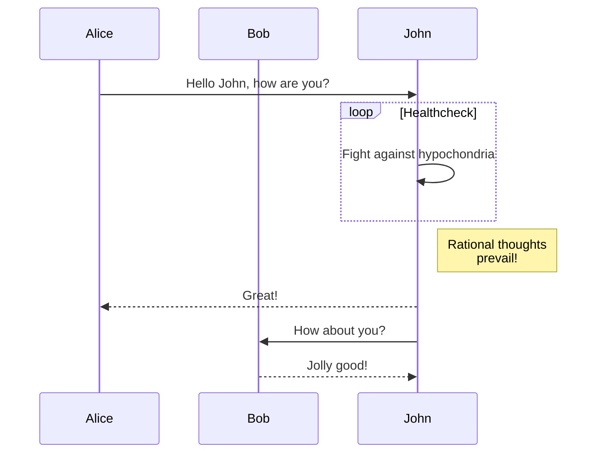
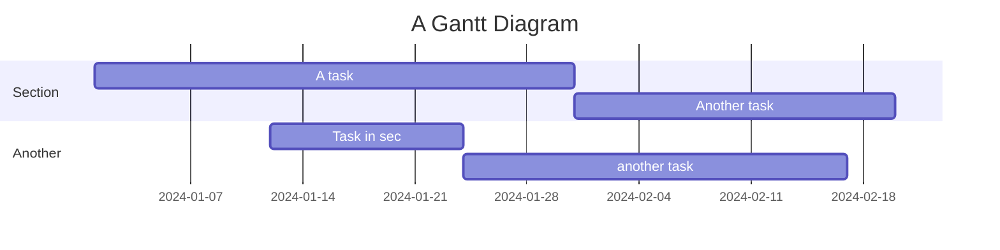

# mermaid-it

CLI tool for rendering Mermaid diagrams using Rust and deno_core.

## Features

- 🚀 Fast rendering with embedded Mermaid.js
- 📦 Self-contained binary
- 🎨 Multiple formats: SVG, PNG, JPG, WebP, GIF
- 🔧 Custom Mermaid.js support
- 📏 Configurable dimensions, scale, background, and themes
- 🖥️ Cross-platform

## Installation

### From Source

```bash
git clone https://github.com/yourusername/mermaid-it.git
cd mermaid-it
cargo build --release
# Binary at: target/release/mermaid-it
```

### Global Install

```bash
cargo install --path .
```

## Usage

### Basic

```bash
# From file
mermaid-it diagram.mmd

# From stdin
echo "graph TD; A-->B;" | mermaid-it -

# Specify output
mermaid-it diagram.mmd -o output.svg
```

### Output Formats

```bash
mermaid-it diagram.mmd -o output.svg       # SVG (default)
mermaid-it diagram.mmd -o output.png -f png
mermaid-it diagram.mmd -o output.jpg -f jpg
mermaid-it diagram.mmd -o output.webp -f webp
mermaid-it diagram.mmd -o output.gif -f gif
```

### Customization

```bash
# Dimensions
mermaid-it diagram.mmd -W 1200 -H 800 -o output.png -f png

# Scale
mermaid-it diagram.mmd --scale 2.0 -o output.png -f png

# Background
mermaid-it diagram.mmd --background "#f0f0f0" -o output.svg

# Theme
mermaid-it diagram.mmd --theme dark -o output.svg

# Custom Mermaid.js
mermaid-it diagram.mmd --custom-mermaid ./custom-mermaid.js -o output.svg
```

### Options

```
-o, --output <OUTPUT>           Output file [default: output.svg]
-f, --format <FORMAT>           Format [svg, png, jpg, webp, gif]
-W, --width <WIDTH>             Width in pixels [default: 800]
-H, --height <HEIGHT>           Height in pixels [default: 600]
-b, --background <BACKGROUND>   Background color [default: white]
-t, --theme <THEME>             Theme [default: default]
-s, --scale <SCALE>             Scale factor [default: 1.0]
-c, --custom-mermaid <PATH>     Custom Mermaid.js file
-d, --debug                     Debug output
-h, --help                      Help
-V, --version                   Version
```

## Examples

### Flowchart

`flowchart.mmd`:


```bash
mermaid-it flowchart.mmd -o flowchart.png -f png -W 1024 -H 768
```

### Sequence Diagram

`sequence.mmd`:


```bash
mermaid-it sequence.mmd -o sequence.svg --theme dark
```

### Gantt Chart

`gantt.mmd`:


```bash
mermaid-it gantt.mmd -o gantt.png -f png -W 1200
```

## Custom Mermaid.js

Use a specific version:

```bash
# Download
wget https://cdn.jsdelivr.net/npm/mermaid@10.6.1/dist/mermaid.min.js

# Use
mermaid-it diagram.mmd --custom-mermaid ./mermaid.min.js -o output.svg
```

## Development

```bash
cargo build              # Debug build
cargo build --release    # Release build
cargo test              # Run tests
cargo run -- diagram.mmd -d  # Debug mode
```

### Structure

```
mermaid-it/
├── Cargo.toml       # Dependencies
├── build.rs         # Build script
├── src/
│   ├── main.rs      # Entry point
│   ├── cli.rs       # CLI parsing
│   ├── renderer.rs  # Rendering logic
│   └── js/
│       └── init.js  # JS runtime
└── README.md
```

## Troubleshooting

For large diagrams:

```bash
mermaid-it large.mmd -W 2000 -H 2000 --scale 2.0 -o large.png -f png
```

## License

MIT

## Contributing

Pull requests welcome!

## Credits

- [Mermaid.js](https://mermaid-js.github.io/) - Diagram rendering
- [deno_core](https://github.com/denoland/deno) - JavaScript runtime
- [clap](https://github.com/clap-rs/clap) - CLI parsing
- [resvg](https://github.com/RazrFalcon/resvg) - SVG to PNG conversion