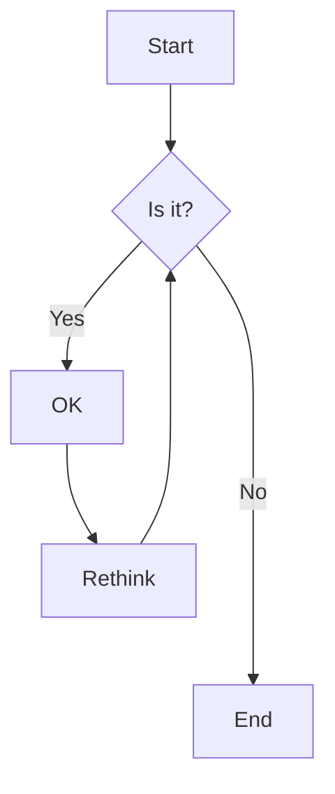
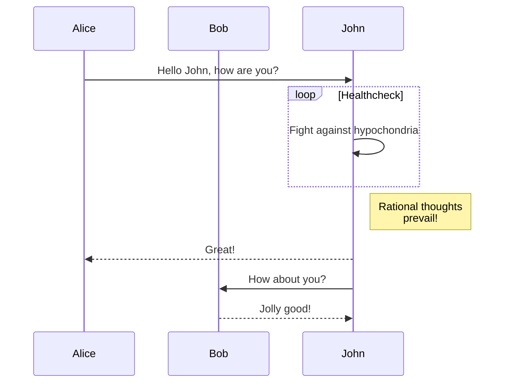
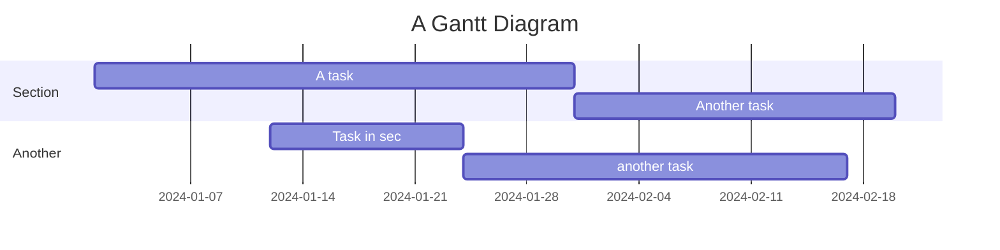

# mermaid-it

A powerful CLI tool and library for rendering Mermaid diagrams using Rust and deno_core as the JavaScript runtime engine.

## Features

- 🚀 **Fast rendering** using embedded Mermaid.js
- 📦 **Self-contained** - Mermaid.js is embedded in the binary
- 🎨 **Multiple output formats** - SVG, PNG, JPG, WebP, and GIF
- 🔧 **Customizable** - Support for custom Mermaid.js versions
- 📏 **Configurable output** - Set dimensions, scale, background, and themes
- 🖥️ **Cross-platform** - Works on Linux, macOS, and Windows
- 🌍 **Multi-language bindings** - Python, Ruby, Kotlin, Swift, Go, Java via UniFFI
- 🌐 **Web support** - JavaScript/TypeScript via WebAssembly

## Language Bindings

Mermaid-it provides native bindings for multiple programming languages through **UniFFI**:

| Language | Status | Package Manager | Import |
|----------|--------|----------------|---------|
| **Python** | ✅ Ready | PyPI | `import mermaid_it` |
| **Ruby** | ✅ Ready | RubyGems | `require 'mermaid_it'` |
| **Kotlin** | ✅ Ready | Maven | `import mermaid_it.*` |
| **Swift** | ✅ Ready | SwiftPM | `import MermaidIt` |
| **Go** | ✅ Ready | Go Modules | `import "github.com/.../mermaid-it/bindings/go"` |
| **Java** | ✅ Ready | Maven (via Kotlin) | `import mermaid_it.*;` |
| **JavaScript** | ✅ Ready | npm | `import { MermaidRenderer } from 'mermaid-it-wasm'` |

For detailed language binding documentation, see [UNIFFI_BINDINGS.md](UNIFFI_BINDINGS.md).

## Installation

### CLI Tool

```bash
# From source
cargo install --path . --features cli

# Or download pre-built binary from releases
```

### Language-Specific Installation

#### Python
```bash
pip install mermaid-it
```

#### Ruby
```bash
gem install mermaid-it
```

#### Go
```bash
go get github.com/yourusername/mermaid-it/bindings/go
```

#### JavaScript/TypeScript
```bash
npm install mermaid-it-wasm
```

## Quick Start

### CLI Usage

```bash
# Render a Mermaid diagram from a file
mermaid-it diagram.mmd

# Render from stdin
echo "graph TD; A-->B;" | mermaid-it -

# Specify output file and format
mermaid-it diagram.mmd -o output.png -f png
```

### Library Usage

#### Python
```python
import mermaid_it

renderer = mermaid_it.MermaidRenderer()
svg = renderer.render_to_string("graph TD; A-->B;", mermaid_it.RenderOptions())
```

#### Ruby
```ruby
require 'mermaid_it'

renderer = MermaidIt::MermaidRenderer.new
svg = renderer.render_to_string("graph TD; A-->B;", MermaidIt::RenderOptions.new)
```

#### Go
```go
import "github.com/yourusername/mermaid-it/bindings/go"

renderer, _ := mermaid.NewRenderer()
defer renderer.Close()
svg, _ := renderer.RenderToString("graph TD; A-->B;", mermaid.DefaultOptions())
```

#### JavaScript
```javascript
import { MermaidRenderer } from 'mermaid-it-wasm';

const renderer = new MermaidRenderer();
const svg = await renderer.render("graph TD; A-->B;", { format: 'svg' });
```

## Unified API

All language bindings share the same consistent API:

```
// Create renderer
renderer = new MermaidRenderer()

// Render options
options = {
  format: "png",      // svg, png, jpg, jpeg, webp, gif
  width: 800,         // pixels
  height: 600,        // pixels
  background: "white", // CSS color
  theme: "default",   // default, dark, forest, neutral
  scale: 1.0,         // scale factor
  quality: 90         // JPEG/WebP quality (0-100)
}

// Render methods
bytes = renderer.render(diagram, options)           // Returns raw bytes
string = renderer.render_to_string(diagram, options) // Returns string (for SVG)
renderer.render_to_file(diagram, path, options)     // Saves to file
```

## Examples

### Flowchart

Create a file `flowchart.mmd`:


Render it:
```bash
mermaid-it flowchart.mmd -o flowchart.png -f png -W 1024 -H 768
```

### Sequence Diagram

Create a file `sequence.mmd`:


Render it:
```bash
mermaid-it sequence.mmd -o sequence.svg --theme dark
```

### Gantt Chart

Create a file `gantt.mmd`:


Render it:
```bash
mermaid-it gantt.mmd -o gantt.png -f png -W 1200
```

## Using Custom Mermaid.js

You can provide your own Mermaid.js file if you need a specific version or custom build:

1. Download your desired Mermaid.js version:
```bash
wget https://cdn.jsdelivr.net/npm/mermaid@10.6.1/dist/mermaid.min.js
```

2. Use it with mermaid-it:
```bash
mermaid-it diagram.mmd --custom-mermaid ./mermaid.min.js -o output.svg
```

## Development

### Building from Source

```bash
# Build CLI tool
cargo build --release --features cli

# Build with UniFFI bindings
cargo build --release --features uniffi-bindings

# Generate all language bindings
./generate_bindings.sh

# Run tests
cargo test --all-features
```

### Project Structure

```
mermaid-it/
├── Cargo.toml          # Project dependencies
├── build.rs            # Build script
├── src/
│   ├── main.rs         # CLI entry point
│   ├── lib.rs          # Library interface
│   ├── cli.rs          # CLI argument parsing
│   ├── renderer.rs     # Core rendering logic
│   ├── uniffi_bindings.rs # UniFFI binding definitions
│   ├── c_bindings.rs   # C FFI for Go
│   ├── wasm_bindings.rs # WASM bindings
│   └── mermaid_it.udl  # UniFFI interface definition
├── bindings/           # Generated language bindings
│   ├── python/
│   ├── ruby/
│   ├── kotlin/
│   ├── swift/
│   ├── go/
│   └── wasm/
├── examples/           # Example code for each language
└── packaging/          # Package configurations
```

## Troubleshooting

### Large Diagrams

For very large diagrams, you may need to increase the dimensions:

```bash
mermaid-it large-diagram.mmd -W 2000 -H 2000 --scale 2.0 -o large.png -f png
```

## License

MIT License - See LICENSE file for details

## Contributing

Contributions are welcome! Please feel free to submit a Pull Request.

## Acknowledgments

- [Mermaid.js](https://mermaid-js.github.io/) for the amazing diagram rendering library
- [deno_core](https://github.com/denoland/deno) for the JavaScript runtime
- [clap](https://github.com/clap-rs/clap) for CLI parsing
- [resvg](https://github.com/RazrFalcon/resvg) for SVG to PNG conversion