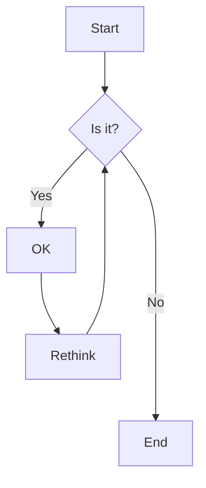
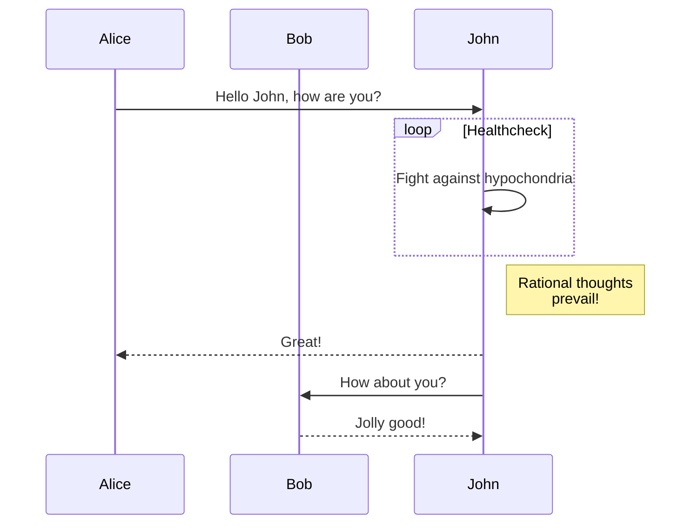
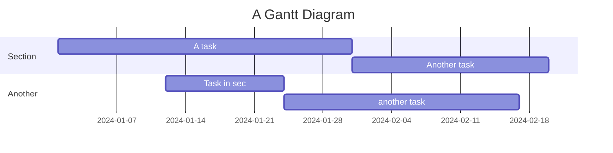

# mermaid-it

A powerful CLI tool to render Mermaid diagrams using Rust and deno_core as the JavaScript runtime engine.

## Features

- 🚀 **Fast rendering** using embedded Mermaid.js
- 📦 **Self-contained** - Mermaid.js is embedded in the binary
- 🎨 **Multiple output formats** - SVG and PNG
- 🔧 **Customizable** - Support for custom Mermaid.js versions
- 📏 **Configurable output** - Set dimensions, scale, background, and themes
- 🖥️ **Cross-platform** - Works on Linux, macOS, and Windows

## Installation

### From Source

```bash
# Clone the repository
git clone https://github.com/yourusername/mermaid-it.git
cd mermaid-it

# Build the project
cargo build --release

# The binary will be available at target/release/mermaid-it
```

### Install Globally

```bash
cargo install --path .
```

## Usage

### Basic Usage

```bash
# Render a Mermaid diagram from a file
mermaid-it diagram.mmd

# Render from stdin
echo "graph TD; A-->B;" | mermaid-it -

# Specify output file
mermaid-it diagram.mmd -o output.svg
```

### Output Formats

```bash
# Generate SVG (default)
mermaid-it diagram.mmd -o output.svg

# Generate PNG
mermaid-it diagram.mmd -o output.png -f png
```

### Customization Options

```bash
# Set custom dimensions
mermaid-it diagram.mmd -W 1200 -H 800 -o output.png -f png

# Set scale factor
mermaid-it diagram.mmd --scale 2.0 -o output.png -f png

# Set background color
mermaid-it diagram.mmd --background "#f0f0f0" -o output.svg

# Use a different theme
mermaid-it diagram.mmd --theme dark -o output.svg

# Use custom Mermaid.js file
mermaid-it diagram.mmd --custom-mermaid ./custom-mermaid.js -o output.svg
```

### Command-Line Options

```
Options:
  -o, --output <OUTPUT>              Output file path [default: output.svg]
  -f, --format <FORMAT>              Output format [default: svg] [possible values: svg, png]
  -W, --width <WIDTH>                Width of the output image in pixels [default: 800]
  -H, --height <HEIGHT>              Height of the output image in pixels [default: 600]
  -b, --background <BACKGROUND>      Background color (CSS color value) [default: white]
  -t, --theme <THEME>                Mermaid theme [default: default]
  -s, --scale <SCALE>                Scale factor for the output [default: 1.0]
  -c, --custom-mermaid <PATH>        Path to custom Mermaid.js file
  -d, --debug                        Enable debug output
  -h, --help                         Print help
  -V, --version                      Print version
```

## Examples

### Flowchart

Create a file `flowchart.mmd`:


Render it:
```bash
mermaid-it flowchart.mmd -o flowchart.png -f png -W 1024 -H 768
```

### Sequence Diagram

Create a file `sequence.mmd`:


Render it:
```bash
mermaid-it sequence.mmd -o sequence.svg --theme dark
```

### Gantt Chart

Create a file `gantt.mmd`:


Render it:
```bash
mermaid-it gantt.mmd -o gantt.pdf -f pdf -W 1200
```

## Using Custom Mermaid.js

You can provide your own Mermaid.js file if you need a specific version or custom build:

1. Download your desired Mermaid.js version:
```bash
wget https://cdn.jsdelivr.net/npm/mermaid@10.6.1/dist/mermaid.min.js
```

2. Use it with mermaid-it:
```bash
mermaid-it diagram.mmd --custom-mermaid ./mermaid.min.js -o output.svg
```

## Development

### Building from Source

```bash
# Debug build
cargo build

# Release build (optimized)
cargo build --release

# Run tests
cargo test

# Run with debug output
cargo run -- diagram.mmd -d
```

### Project Structure

```
mermaid-it/
├── Cargo.toml          # Project dependencies
├── build.rs            # Build script to download and embed Mermaid.js
├── src/
│   ├── main.rs         # Main application entry point
│   ├── cli.rs          # CLI argument parsing
│   ├── renderer.rs     # Mermaid rendering logic using deno_core
│   └── js/
│       └── init.js     # JavaScript runtime initialization
└── README.md           # This file
```

## Troubleshooting

### PDF Generation

For PDF generation, the tool attempts to use `rsvg-convert` if available on your system. For best results, install it:

```bash
# Ubuntu/Debian
sudo apt-get install librsvg2-bin

# macOS
brew install librsvg

# Fedora
sudo dnf install librsvg2-tools
```

If `rsvg-convert` is not available, a basic PDF will be generated with embedded SVG.

### Large Diagrams

For very large diagrams, you may need to increase the dimensions:

```bash
mermaid-it large-diagram.mmd -W 2000 -H 2000 --scale 2.0 -o large.png -f png
```

## License

MIT License - See LICENSE file for details

## Contributing

Contributions are welcome! Please feel free to submit a Pull Request.

## Acknowledgments

- [Mermaid.js](https://mermaid-js.github.io/) for the amazing diagram rendering library
- [deno_core](https://github.com/denoland/deno) for the JavaScript runtime
- [clap](https://github.com/clap-rs/clap) for CLI parsing
- [resvg](https://github.com/RazrFalcon/resvg) for SVG to PNG conversion